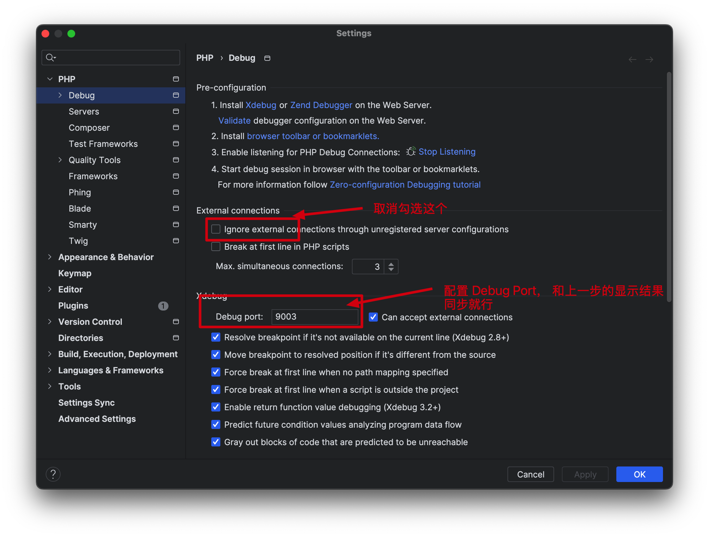

# PHP代码审计环境-Docker-compose

## 介绍

快速搭建PHP代码审计环境，支持使用 PHPStorm 进行调试。支持单/多套源码同时部署，只需要简单配置下Nginx即可。

使用案例，可以参考我的博客：[使用docker-compose快速搭建PHP代码审计环境](https://n0el4kls.github.io/posts/25-%E4%BD%BF%E7%94%A8docker-compose%E5%BF%AB%E9%80%9F%E6%90%AD%E5%BB%BAphp%E4%BB%A3%E7%A0%81%E5%AE%A1%E8%AE%A1%E7%8E%AF%E5%A2%83/)

## Nginx Location 配置示例

```nginx
# 配置 /path_prefix 路径的处理规则
location /path_prefix {
    # 将请求映射到实际的目录，注意最后的斜杠不能省略
    alias /var/www/html/your_path/;
    
    # 设置默认索引文件
    index index.php index.html index.htm;
    
    # 路由重写规则：依次尝试访问 $uri，$uri/，如果都不存在则重写到 index.php
    try_files $uri $uri/ /app1/index.php?$query_string;

    # 处理 PHP 文件, 下面的配置默认不需要修改
    location ~ \.php$ {
        fastcgi_pass php:9000;
        fastcgi_index index.php;
        fastcgi_param SCRIPT_FILENAME $request_filename;
        include fastcgi_params;
    }
}
```

## PHPStorm 调试配置

### 1. 检查Xdebug

在`设置->PHP->Debug`中,使用`validate`查看`Debug`是否成功。


从显示信息中，可以看到端口为`9003`，设置`Debug port`:



### 2. 配置DBGp Proxy

Port和上面同步，其他地方照抄就行。


### 3.调试


设置完之后,打开`xdebug` ，下断点调试就行了


### 4.配置目录映射(可选)

如果配置好后，第一次调试没有出现目录映射相关的信息，就手动映射一下


**关于部分时候断点调试捕获不了的问题：**

临时解决方案：在 `Setting----->PHP---->servers` 处的映射路径多填写一点.具体原因还在排查.

